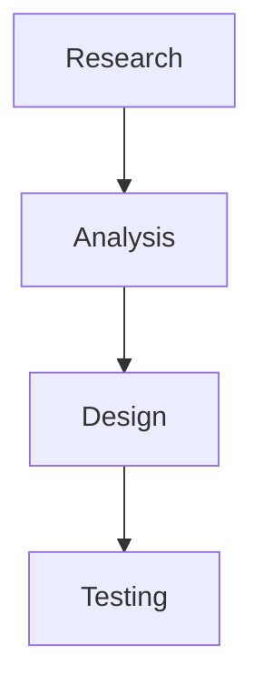

# Week 2: Explore Deeper - Advanced VS Code & Markdown

**Optional material for mastering VS Code productivity**

---

## When to Use This

Return to this file when:
- You've completed the main Week 2 exercises
- You want to work faster in VS Code
- You're editing multiple files daily
- You want to customize your workspace
- You have extra time for skill development

**This is NOT required.** The basics from Week 2 are sufficient.

---

## Advanced VS Code Shortcuts

### Multi-Cursor Editing

**Add cursor above/below:**
- `Option + Command + Up` - Add cursor above
- `Option + Command + Down` - Add cursor below

**Select all occurrences:**
- `Command + Shift + L` - Select all instances of selected text
- `Command + D` - Select next occurrence

**Example use case:**
```
- Item one
- Item two
- Item three
```

Place cursor on "Item", press `Command + Shift + L`, type replacement for all at once.

---

### Navigation Shortcuts

**Jump to line:**
- `Control + G` - Go to line number
- Type line number, press Enter

**Jump to symbol:**
- `Command + Shift + O` - See all headings in current file
- Type to filter, Enter to jump

**Go back/forward:**
- `Control + -` - Navigate backward
- `Control + Shift + -` - Navigate forward

**Jump to matching bracket:**
- `Command + Shift + \` - Jump between opening and closing brackets

---

### Search and Replace

**Find:**
- `Command + F` - Find in current file
- `Command + Option + F` - Replace in current file

**Find across files:**
- `Command + Shift + F` - Search all files
- `Command + Shift + H` - Replace in all files

**Regex search:**
- Enable regex with `.*` button in search box
- Example: `\d{3}` finds 3-digit numbers

---

### Selection Shortcuts

**Expand selection:**
- `Control + Shift + Command + Right` - Expand selection
- `Control + Shift + Command + Left` - Shrink selection

**Select current line:**
- `Command + L` - Select entire line

**Select all between brackets:**
- Place cursor inside brackets
- `Command + Shift + \`

**Column (box) selection:**
- `Shift + Option` + drag mouse
- Creates vertical selection

---

### Code Folding

**Fold/unfold sections:**
- `Command + Option + [` - Fold section
- `Command + Option + ]` - Unfold section
- `Command + K, Command + 0` - Fold all
- `Command + K, Command + J` - Unfold all

**Useful for long markdown documents.**

---

### Advanced Editing

**Move line up/down:**
- `Option + Up` - Move line up
- `Option + Down` - Move line down

**Copy line up/down:**
- `Shift + Option + Up` - Duplicate line above
- `Shift + Option + Down` - Duplicate line below

**Delete line:**
- `Command + Shift + K` - Delete entire line

**Insert line:**
- `Command + Enter` - Insert line below
- `Command + Shift + Enter` - Insert line above

**Join lines:**
- `Control + J` - Join current line with next

---

### Markdown-Specific Features

**Preview to side:**
- `Command + K, V` - Open preview to side
- Edit left, preview right

**Toggle preview:**
- `Command + Shift + V` - Toggle preview in tab

**Automatic Table of Contents:**
- Install "Markdown All in One" extension
- Creates clickable TOC from headings

**Auto-formatting:**
- `Shift + Option + F` - Format document
- Fixes inconsistent spacing, list formatting

---

## Advanced Markdown Techniques

### Document Organization

**Use comments (invisible in preview):**
```markdown
<!-- This is a comment - won't appear in rendered version -->

## Public Heading

<!-- TODO: Add more research data here -->
```

**Anchor links to headings:**
```markdown
Jump to [Recommendations](#recommendations)

## Recommendations
Content here...
```

GitHub auto-creates anchors from headings.

---

### Advanced Tables

**Alignment:**
```markdown
| Left-aligned | Center-aligned | Right-aligned |
|:-------------|:--------------:|--------------:|
| Left         | Center         | Right         |
```

**`:---` = left**
**`:---:` = center**
**`---:` = right**

**Complex cells:**
```markdown
| Feature | Details |
|---------|---------|
| Multi<br>Line | Use `<br>` for line breaks |
| **Bold** | Inline formatting works |
| `Code` | Technical terms |
```

---

### Advanced Lists

**Mixed list types:**
```markdown
1. First ordered item
   - Nested unordered item
   - Another nested item
2. Second ordered item
   1. Nested ordered item
   2. Another nested ordered
```

**Definition lists (some parsers):**
```markdown
Term
: Definition of the term

Another term
: Another definition
```

---

### Collapsible Sections

**Using HTML details tag:**
```markdown
<details>
<summary>Click to see research methodology</summary>

We conducted:
- 12 user interviews
- 8 usability tests
- Card sorting exercise

</details>
```

**Renders as collapsible section on GitHub.**

---

### Embedding Content

**YouTube videos (GitHub):**
```markdown
[](https://www.youtube.com/watch?v=VIDEO_ID)
```

**Mermaid diagrams (GitHub):**
````markdown

````

**Creates flowcharts directly in markdown!**

---

### Math Equations (GitHub)

**Inline math:**
```markdown
The formula is $E = mc^2$
```

**Block math:**
```markdown
$$
\sum_{i=1}^{n} x_i = x_1 + x_2 + ... + x_n
$$
```

**Uses LaTeX syntax.**

---

## VS Code Extensions for UX Work

### Essential Extensions

**Markdown All in One**
- Keyboard shortcuts
- Auto-complete
- Table of contents
- Table formatting
- List editing

**Markdown Preview Enhanced**
- Better preview
- Export to PDF/HTML
- Customizable themes
- Presentation mode

**markdownlint**
- Style checker
- Consistency enforcer
- Catches common errors

---

### Productivity Extensions

**Prettier**
- Auto-formats markdown
- Consistent styling
- Saves manually formatting

**Code Spell Checker**
- Catches typos
- Essential for documentation
- Custom dictionaries

**Path Intellisense**
- Autocompletes file paths
- Reduces broken links
- Helpful for images

**Bracket Pair Colorizer 2**
- Colors matching brackets
- Easier to spot structure
- Good for complex documents

---

### Collaboration Extensions

**Live Share**
- Real-time collaborative editing
- Share your VS Code session
- Great for pair documentation

**GitLens**
- See Git blame inline
- Track who changed what
- View commit history

**GitHub Pull Requests**
- Review PRs in VS Code
- Comment on code
- Merge without leaving editor

---

## Workspace Customization

### Settings

**Access settings:**
- `Command + ,` - Open settings
- Search for specific settings

**Recommended settings for markdown:**
```json
{
  "editor.wordWrap": "on",
  "editor.wrappingIndent": "same",
  "markdown.preview.breaks": true,
  "editor.defaultFormatter": "esbenp.prettier-vscode",
  "editor.formatOnSave": true,
  "files.autoSave": "afterDelay",
  "files.autoSaveDelay": 1000
}
```

**Edit settings.json:**
- `Command + Shift + P`
- Type "Open Settings JSON"
- Add your preferences

---

### Themes

**Change color theme:**
- `Command + K, Command + T` - Theme picker
- Preview themes before applying

**Popular themes:**
- GitHub Theme (familiar)
- One Dark Pro (dark)
- Material Theme (colorful)
- Dracula (high contrast)

**Markdown-optimized themes:**
- iA Writer theme
- Typora theme

---

### Keyboard Shortcuts Customization

**Edit shortcuts:**
- `Command + K, Command + S` - Keyboard Shortcuts
- Search for command
- Click to rebind

**Export/import shortcuts:**
- Consistent across machines
- Share with team

---

### Snippets

**Create custom snippets:**
- `Command + Shift + P`
- Type "Configure User Snippets"
- Select "markdown"

**Example snippet:**
```json
{
  "Research Finding": {
    "prefix": "finding",
    "body": [
      "## Finding: ${1:Title}",
      "",
      "${2:Description}",
      "",
      "**Evidence:**",
      "- ${3:Evidence}",
      "",
      "**Recommendation:**",
      "${4:Recommendation}",
      ""
    ],
    "description": "UX research finding template"
  }
}
```

**Usage:** Type `finding`, press Tab, fill in placeholders.

---

## Workflow Optimization

### Multi-File Editing

**Split editor:**
- Drag file to side
- Or: `Command + \` - Split editor
- Work on multiple files side-by-side

**Editor groups:**
- Up to 3 columns or rows
- Drag to rearrange
- `Command + 1/2/3` - Jump between groups

**Zen Mode:**
- `Command + K, Z` - Distraction-free writing
- Full screen, hide sidebar
- Press `Escape` twice to exit

---

### File Management

**Quick open:**
- `Command + P` - Open file by name
- Type partial name
- Fuzzy matching

**Recent files:**
- `Control + R` - Recent folders
- `Control + Tab` - Recent files

**Create new file:**
- `Control + N` - New file
- Start typing, save later

**Explorer sidebar:**
- `Command + Shift + E` - Toggle explorer
- Right-click for file operations

---

### Terminal Integration

**Toggle terminal:**
- ``Control + ` `` - Show/hide terminal

**Multiple terminals:**
- Click + in terminal panel
- `Command + \` - Split terminal

**Run terminal commands:**
- Navigate to file
- Run git commands
- All without leaving VS Code

**Terminal selection:**
- Select text in terminal
- `Command + C` - Copy
- Click to paste

---

## Advanced Markdown Workflow

### Documentation Systems

**GitBook-style organization:**
```
docs/
├── README.md (home)
├── SUMMARY.md (navigation)
├── research/
│   ├── README.md
│   ├── methods.md
│   └── findings.md
└── design/
    ├── README.md
    └── decisions.md
```

**Link between documents:**
```markdown
See [research methods](../research/methods.md) for details.
```

---

### Templates

**Create reusable templates:**

**Research Finding Template:**
```markdown
# Research Finding: [Title]

## Date
[YYYY-MM-DD]

## Participants
- Count: X
- Recruitment: [method]

## Key Insight
[One sentence summary]

## Evidence
- Quote 1
- Quote 2
- Observation 1

## Recommendation
[Action item]

## Impact
[Expected outcome]
```

**Meeting Notes Template:**
```markdown
# Meeting: [Topic]

**Date:** [YYYY-MM-DD]
**Attendees:** [Names]
**Duration:** [Time]

## Agenda
1. Item 1
2. Item 2

## Discussion Notes
[Notes]

## Decisions
- [ ] Decision 1 - Owner: [Name]
- [ ] Decision 2 - Owner: [Name]

## Action Items
- [ ] Action 1 - @owner - Due: [date]
- [ ] Action 2 - @owner - Due: [date]

## Next Meeting
**Date:** [YYYY-MM-DD]
**Topics:** [List]
```

---

### Version Control for Docs

**Meaningful commit messages:**
```bash
git commit -m "Add user interview findings from Jan 2025"
git commit -m "Update persona based on stakeholder feedback"
git commit -m "Fix broken links in research summary"
```

**Document evolution:**
- Each commit = snapshot
- Can see how thinking evolved
- Can revert to previous versions

**Use branches for major revisions:**
```bash
git checkout -b redesign/persona-updates
# Make significant changes
# Create PR for review
```

---

## Productivity Tips

### Daily Workflow

**Morning:**
1. `Command + Shift + P` → "Git: Pull"
2. `Command + P` → Open today's notes
3. Check task list in markdown

**During work:**
1. Use snippets for common structures
2. Auto-save catches everything
3. Commit frequently
4. Push at natural breakpoints

**End of day:**
1. Review changed files
2. Commit with descriptive message
3. Push to backup work
4. Update task list for tomorrow

---

### Keyboard-First Workflow

**Minimize mouse usage:**
- `Command + P` - Open file (not clicking in sidebar)
- `Command + Shift + P` - Commands (not hunting menus)
- `Command + W` - Close file (not clicking X)
- `Command + B` - Toggle sidebar (not clicking icon)

**Speed goal:** Stay in keyboard flow for 80%+ of work.

---

### Focus Techniques

**Pomodoro with Zen Mode:**
1. Enter Zen Mode (`Command + K, Z`)
2. Work for 25 minutes
3. Exit, take break
4. Repeat

**Distraction-free writing:**
1. Hide sidebar
2. Hide terminal
3. Full screen
4. Just you and the document

---

## Troubleshooting

### Performance Issues

**Large files slow?**
- Disable extensions for that file type
- Turn off auto-save temporarily
- Split into smaller files

**Preview laggy?**
- Disable fancy extensions in preview
- Use basic preview
- Close preview when not needed

---

### Extension Conflicts

**VS Code acting weird?**
1. Disable all extensions
2. Enable one at a time
3. Find the culprit
4. Report bug or find alternative

**Safe mode:**
- `Command + Shift + P`
- Type "Disable All Installed Extensions"
- Restart

---

### Sync Issues

**Settings not syncing?**
- Enable Settings Sync
- Sign in with GitHub/Microsoft
- Sync across all machines

**Conflicts:**
- Pick local or remote version
- Merge manually if needed

---

## Resources

### Official Documentation
- [VS Code Markdown](https://code.visualstudio.com/docs/languages/markdown)
- [VS Code Keyboard Shortcuts](https://code.visualstudio.com/shortcuts/keyboard-shortcuts-macos.pdf)
- [VS Code Tips & Tricks](https://code.visualstudio.com/docs/getstarted/tips-and-tricks)

### Learning Resources
- [VS Code Can Do That?](https://vscodecandothat.com/) - Tips and tricks
- [VS Code YouTube Channel](https://www.youtube.com/c/Code) - Official tutorials

### Community
- [VS Code Subreddit](https://www.reddit.com/r/vscode/)
- Stack Overflow - Tag: visual-studio-code

---

## Practice Challenges

### Challenge 1: Speed Test

Time yourself doing these tasks:
1. Create new file
2. Add 3-level heading structure
3. Write table with 3 columns, 5 rows
4. Add blockquote
5. Create bulleted and numbered lists
6. Save and preview

**Goal:** Under 3 minutes without looking up syntax.

---

### Challenge 2: Keyboard Only

Complete a full document without using mouse:
- Create file
- Write content
- Format
- Preview
- Save
- Commit

**Goal:** Smooth workflow, no hunting for commands.

---

### Challenge 3: Template Creation

Build 5 custom templates for your UX work:
1. Research finding
2. Meeting notes
3. Design decision
4. User persona
5. Weekly status

**Save as snippets for instant reuse.**

---

## Mastery Checklist

You've mastered VS Code when you can:

- [ ] Navigate entirely with keyboard
- [ ] Use 10+ shortcuts without thinking
- [ ] Edit multiple files efficiently
- [ ] Create custom snippets
- [ ] Use multi-cursor editing
- [ ] Find/replace across project
- [ ] Customize workspace to your needs
- [ ] Integrate terminal workflow
- [ ] Work faster than in any other editor
- [ ] Help others optimize their setup

**At this point:** You're using VS Code like a pro.

---

## Return to Main Course

Continue to Week 3 when ready. You now have deep VS Code knowledge to draw on throughout the rest of the program.

**Remember:** Mastery comes from daily use, not memorization. Keep this as a reference and gradually incorporate new techniques into your workflow.
